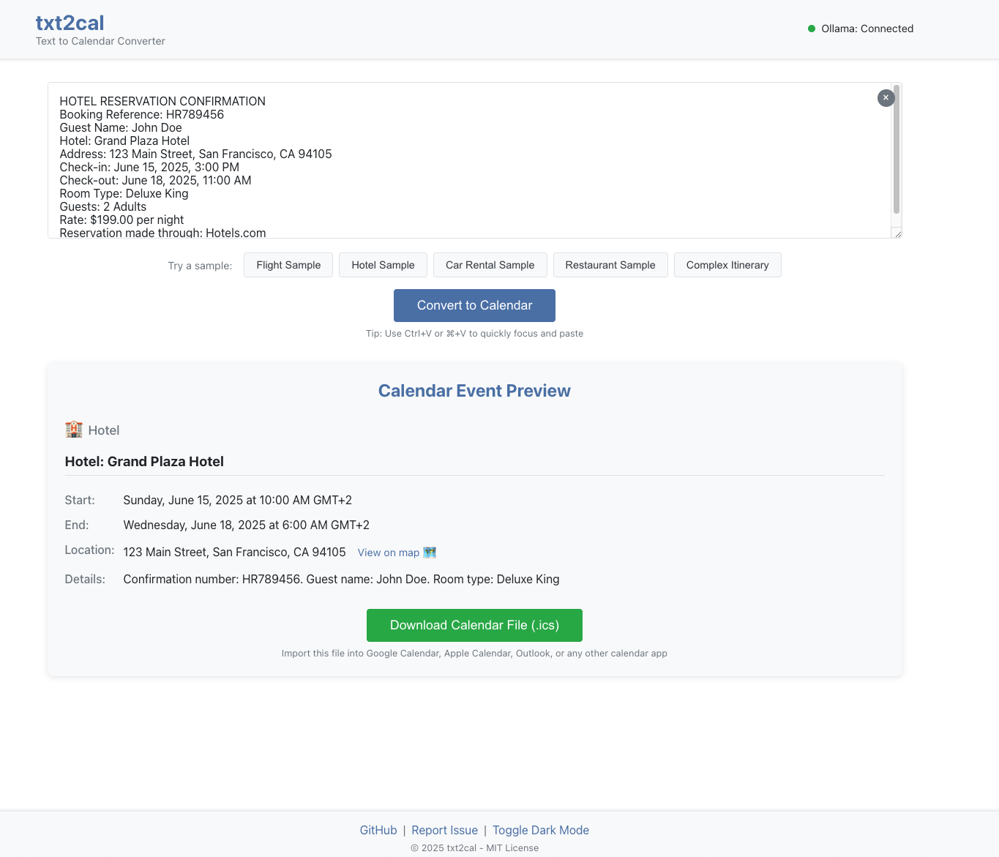

# txt2cal - Text to Calendar Converter

A web application that transforms unstructured travel itinerary text into calendar invites using LLM technology.



## Overview

txt2cal allows users to paste unstructured text from travel confirmations (flights, hotels, car rentals, etc.) and automatically generate calendar (.ics) files that can be imported into any standard calendar application.

## Features

- Simple, user-friendly interface for pasting text
- Intelligent parsing of travel itineraries using LLM technology
- Support for various travel confirmation types (flights, hotels, car rentals)
- Generation of standard .ics calendar files
- Local processing using Ollama for privacy
- Real-time Ollama connection status indicator
- Sample itinerary text for testing
- Calendar event preview before download
- Keyboard shortcuts for improved usability
- Dark mode support
- Responsive design for mobile and desktop
- Location mapping integration
- Optional backend server for environments without local Ollama access
- Docker support for easy deployment

## Quick Start

### Prerequisites

- Modern web browser (Chrome, Firefox, Safari, Edge)
- Node.js v16+ and npm v8+ (for development)
- Ollama installed locally OR access to the backend server
- Docker and Docker Compose (for containerized deployment)

### Installation

#### Local Development

1. Clone the repository:
   ```bash
   git clone https://github.com/maciejjedrzejczyk/txt2cal.git
   cd txt2cal
   ```

2. Install frontend dependencies:
   ```bash
   npm install
   ```

3. Install backend dependencies (optional):
   ```bash
   cd server
   npm install
   cd ..
   ```

4. Start the development server:
   ```bash
   npm start
   ```

5. Start the backend server (optional):
   ```bash
   cd server
   npm start
   ```

6. Open your browser and navigate to `http://localhost:3000`

#### Docker Deployment

1. Clone the repository:
   ```bash
   git clone https://github.com/maciejjedrzejczyk/txt2cal.git
   cd txt2cal
   ```

2. Start the application using Docker Compose:
   ```bash
   docker-compose up -d
   ```

3. Access the application at `http://localhost:3000`

For production deployment:
   ```bash
   docker-compose -f docker-compose.prod.yml up -d
   ```

For more details, see the [Docker Deployment Guide](docs/docker-deployment.md).

### Ollama Setup

This application can use Ollama running locally with a compatible LLM model:

1. Install Ollama from [ollama.ai](https://ollama.ai)
2. Ensure Ollama is running locally on port 11434
3. The application uses the `llama3.2` model by default
   - If you don't have this model, run: `ollama pull llama3.2`

## Usage

1. Ensure either Ollama is running locally or the backend server is accessible (check the status indicator in the app)
2. Paste your travel itinerary text into the input field or use one of the sample buttons
3. Click "Convert to Calendar"
4. Review the calendar event preview
5. Click "Download Calendar File" to get the .ics file
6. Import the .ics file into your preferred calendar application

### Keyboard Shortcuts

- `Ctrl+V` or `⌘+V` - Focus the text input area and paste from clipboard

## Supported Itinerary Types

txt2cal can process various types of travel itineraries:

- **Flight Itineraries**: Extracts flight numbers, departure/arrival times, airports, etc.
- **Hotel Reservations**: Extracts hotel name, check-in/out dates, room details, etc.
- **Car Rentals**: Extracts rental company, pick-up/drop-off times, vehicle details, etc.
- **Restaurant Reservations**: Extracts restaurant name, reservation time, party size, etc.

For detailed examples of supported formats, see the [User Guide](docs/user-guide.md).

## Calendar Format Support

txt2cal generates standard iCalendar (.ics) files that comply with RFC 5545 specifications. These files are compatible with:

- Google Calendar
- Apple Calendar
- Microsoft Outlook
- Mozilla Thunderbird
- Most other calendar applications

## Documentation

- [User Guide](docs/user-guide.md) - Detailed instructions for using txt2cal
- [API Reference](docs/api-reference.md) - Documentation for the backend API
- [Development Guide](docs/development-guide.md) - Guide for developers
- [Docker Deployment Guide](docs/docker-deployment.md) - Instructions for Docker deployment
- [Contributing Guidelines](CONTRIBUTING.md) - How to contribute to the project

## Project Structure

```
txt2cal/
├── public/           # Static files
├── server/           # Backend server
│   ├── middleware/   # Server middleware
│   ├── routes/       # API routes
│   ├── logs/         # Server logs
│   └── server.js     # Server entry point
├── src/              # Frontend source code
│   ├── components/   # UI components
│   ├── services/     # API services
│   ├── utils/        # Utility functions
│   ├── tests/        # Test files
│   ├── App.css       # Main styles
│   ├── App.js        # Main component
│   ├── index.css     # Global styles
│   └── index.js      # Entry point
├── docs/             # Documentation
├── nginx/            # Nginx configuration for Docker
├── Dockerfile.frontend # Frontend Docker configuration
├── Dockerfile.backend  # Backend Docker configuration
├── docker-compose.yml  # Docker Compose for development
├── docker-compose.prod.yml # Docker Compose for production
├── README.md         # Project documentation
└── CONTRIBUTING.md   # Contribution guidelines
```

## Development

### Prerequisites

- Node.js v16+
- npm v8+
- Ollama installed locally (optional)

### Getting Started

1. Install dependencies: `npm install`
2. Start development server: `npm start`
3. Run tests: `npm test`
4. Build for production: `npm run build`

For more detailed development instructions, see the [Development Guide](docs/development-guide.md).

## Testing

Run the test suite:

```bash
npm test
```

Generate test coverage report:

```bash
npm test -- --coverage
```

## Contributing

Contributions are welcome! Please read the [Contributing Guidelines](CONTRIBUTING.md) before submitting a pull request.

## License

[MIT License](LICENSE)

## Acknowledgements

- [Ollama](https://ollama.ai) for providing the local LLM runtime
- [React](https://reactjs.org) for the frontend framework
- [Express](https://expressjs.com) for the backend server
- All contributors who have helped improve this project
